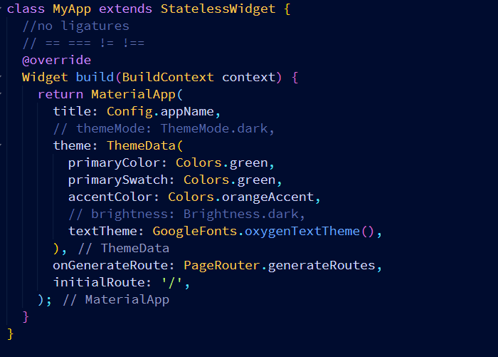

# coders_fonts

## Samples

### 1. [Cascadia](https://github.com/microsoft/cascadia-code)

##### Code

##### Mono

### 2. [JetBrains Mono](https://github.com/JetBrains/JetBrainsMono)

### 3. [Source Code Pro](https://github.com/adobe-fonts/source-code-pro)

### 4. [Inconsolato]()

### 5. [Victor Mono](https://github.com/rubjo/victor-mono)

## Editor Setup

### Visual Studio Code

1. **Open Settings**
   
2. **Enter the name of the font you installed, You can choose add the font weight here I specified Light**

   _You also can choose to enable ligatures,(below font family)_
   

### Android Studio

_coming soon_

### Visual Studio

_coming soon_
