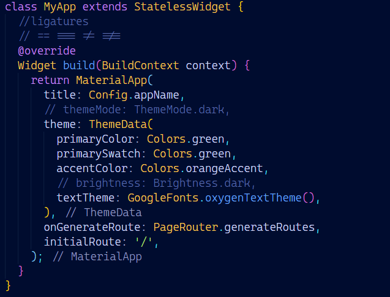
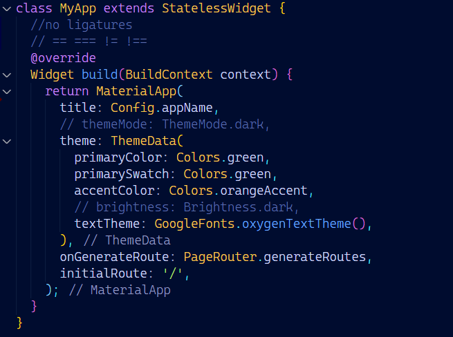
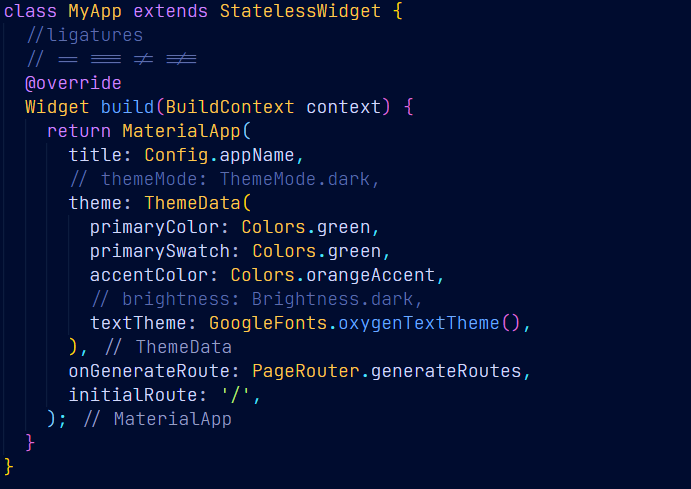
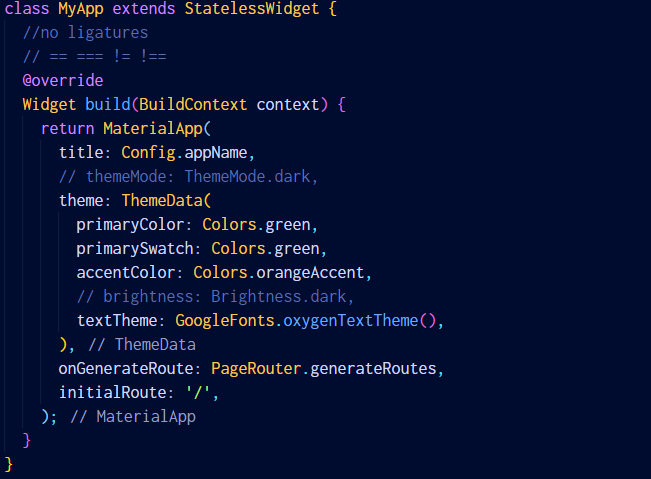
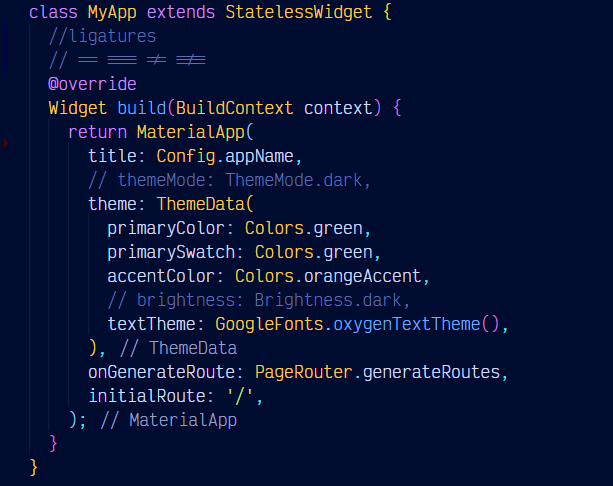
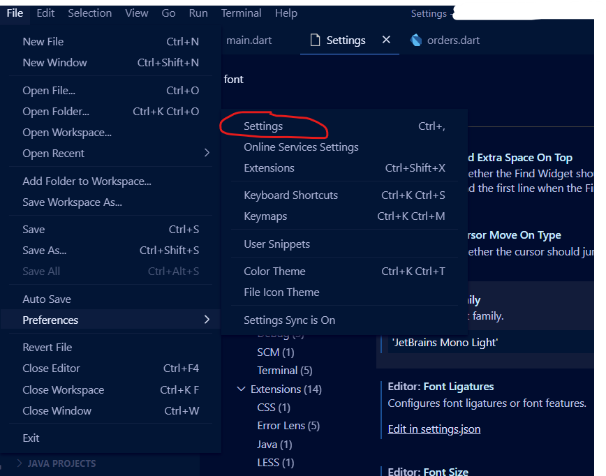
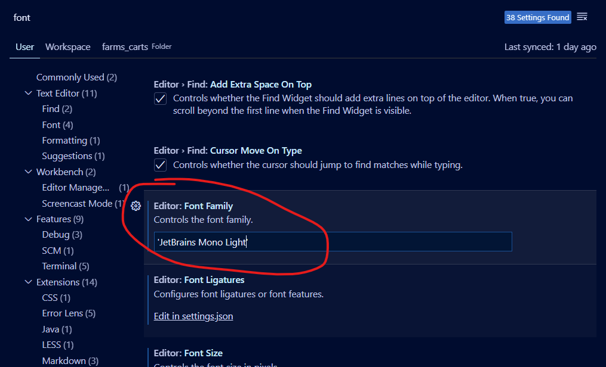

# coders_fonts

#### Samples

## 1. Cascadia

###### Code

###### Mono

## 2. JetBrains Mono

## 3. Source Code Pro

## 4. Inconsolato

## 5. Victor Mono

#### Editor Setup

## Visual Studio Code

1. **Open Settings**
   
2. **Enter the name of the font you installed, You can choose add the font weight here I specified Light**
   

## Android Studio

_coming soon_

## Visual Studio

_coming soon_
